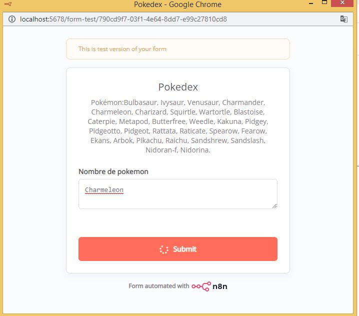
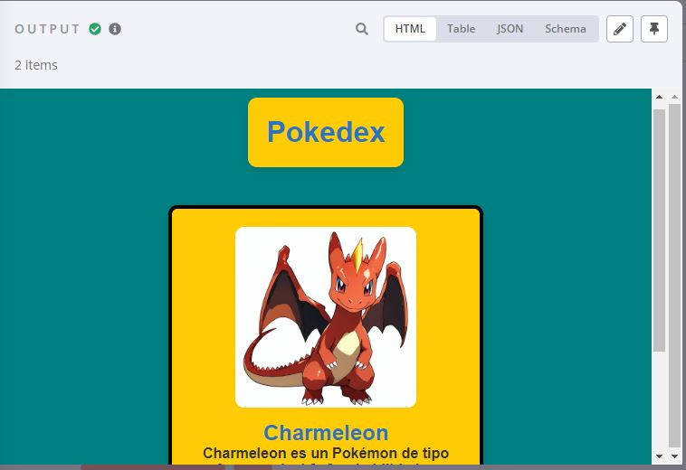
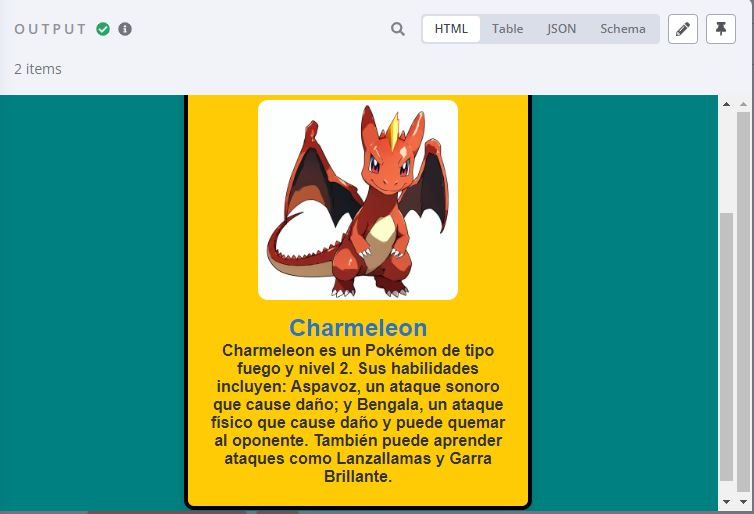

# Pokedex n8n
Proyecto de Pokedex en n8n: Generación de imágenes y descripciones de Pokémon con IA y visualización en HTML integrando APIs y servicios en la nube.

Este proyecto es una Pokedex creada con n8n. El flujo de trabajo permite a los usuarios ingresar el nombre de un Pokémon y genera:

- Una imagen del Pokémon utilizando un modelo de IA de la API Hugging Face.
- Una descripción generada con el uso de la API Mistral AI.
- Una página HTML que muestra la tarjeta del Pokémon con su imagen (generada con IA), nombre y descripción (generada con IA).

## Tecnologías usadas
- n8n (Automatización de flujo de trabajo - Low Code)
- Hugging Face API (Generación de imágenes)
- Mistral AI Chat Model (Generación de texto)
- S3 AWS - Cloudflare R2 (Almacenamiento de imágenes en la nube)
- HTML/CSS (Visualización de datos)

## Instrucciones
1. **Requisitos previos**:
   - Node.js, Docker y n8n instalados en tu sistema.
   - Credenciales de Hugging Face y Cloudflare R2.

2. **Flujo de trabajo**:
   - Importa el archivo `pokedex.json` en tu instancia de n8n.
   - Configura las credenciales necesarias en los nodos correspondientes.

3. **Demostración**:
   Ingreso del nombre del pokemon por parte del usuario:  
   

   Pagina HTML generada:
   
   
